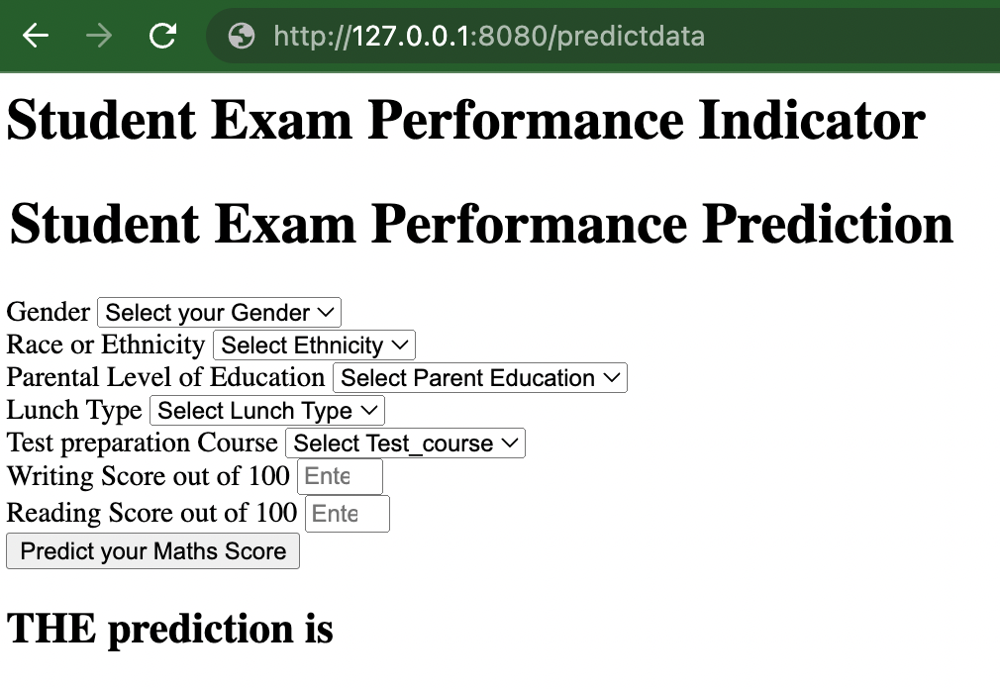

# End-to-End ML Project 
## Student Exam Performance
This repo includes an end-to-end ML project. The focus is mainly on deployment rather than the difficulty of the dataset. 

The dataset is *Student exam performance* from [Kaggles](https://www.kaggle.com/datasets/spscientist/students-performance-in-exams?datasetId=74977) and the prediction type is regression. 

## Run locally
- From the project directory run:

	`python app.py`

- On your browser navigate to `http://127.0.0.1:8080/predictdata`

You should see this: 

<figure align="center">
	
	<figcaption>Fig.1</figcaption>
</figure>

## Run docker
- Build: 

	- `docker build -t mle .`

- Check the built exists:

	- `docker images`

- Run:	

	- `docker run -d --name <CONTAINER_NAME> -p 8080:8080 mle`

- navigate to `http://127.0.0.1:8080/predictdata`

You should see a page shown in *Fig.1*

- Stop the container

	- `docker stop mycontainer_mle`

## Deployment on Microsoft Azure
This model was successfully deployed on Microsoft Azure. To see the deployment, go to Github Actions
 
<figure align="center">
	
</figure>

To replecitae the deployment, refer to [instructions](Instructions.md)

